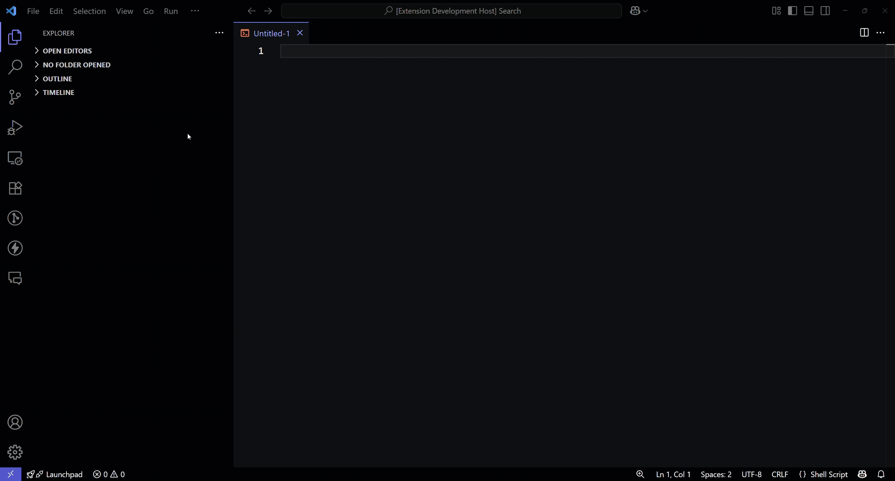

# Ansible PureFA Snippets

**Ansible PureFA Snippets** is a Visual Studio Code extension that allows you to quickly search and insert Pure Storage FlashArray (PureFA) Ansible snippets directly into your editor.  
This extension helps you automate Pure Storage FlashArray management tasks by providing ready-to-use, trusted Ansible playbook examples.

## Features

- Search for Ansible snippets by keyword or description.  
- Insert PureFA Ansible tasks into your playbooks with a single click.  
- Supports multiple Pure Storage Ansible collection versions (1.36.0, 1.35.1).  
- Snippets cover common storage operations: volume provisioning, snapshot management, replication, host connections, and more.

## Installation

1. Open **Visual Studio Code**.  
2. Go to the **Extensions** view (`Ctrl+Shift+X`).  
3. Search for `Ansible PureFA Snippets`.  
4. Click **Install**.  

## Usage

1. Open a YAML or Ansible playbook file in VS Code.  
2. Open the Command Palette (`Ctrl+Shift+P` or `Cmd+Shift+P` on Mac).  
3. Type and select:
   - `Search PureFA Ansible Snippets - v1.36.0`  
   - or `Search PureFA Ansible Snippets - v1.35.1`
4. Search for a snippet by keyword or description.  
5. Select a snippet to insert it at your cursor location.  

## References

- https://galaxy.ansible.com/ui/repo/published/purestorage/flasharray 
- https://github.com/Pure-Storage-Ansible/FlashArray-Collection 

## License

MIT License  

## Author

Developed and maintained by [Rajesh V U](https://www.rajeshvu.com)  
